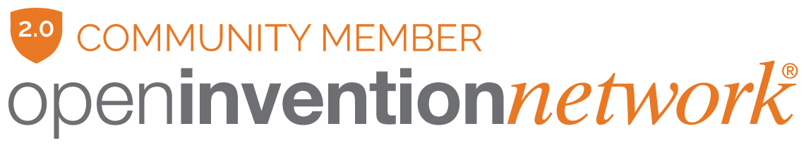

# NawaOS

**A gaming Linux distribution, built on Debian 13**

توزيعة لينكس للألعاب، مبنية على دبيان 13

[Website](https://nawaos.com) · [Download](https://nawaos.com/#download) · [Report an issue](https://github.com/AHMED-ABDULLA-BH/nawaos/issues)

---

## What is NawaOS?

NawaOS turns a plain PC into a gaming machine without the usual setup weekend. Steam, Lutris, RetroArch, Wine/Proton and the emulators are ready from the first boot, and the system takes care of the boring parts: drivers, snapshots before updates, and a firewall that is on by default.

Version 2.0 adds a bilingual setup wizard (Arabic / English), an app store with 60+ curated titles, phone remote control that runs in the browser, cloud save sync, Instant Replay (Super+R saves the last 30 seconds), and full handheld support for ROG Ally, Legion Go and Steam Deck.

## نبذة

‏NawaOS يحوّل أي جهاز عادي إلى جهاز ألعاب بدون عناء التجهيز المعتاد. ستيم ولوتريس وريترو آرك وواين/بروتون والمحاكيات جاهزة من أول إقلاع، والنظام يتكفل بالباقي: التعريفات، ولقطات قبل كل تحديث ترجعك لو صار خلل، وجدار حماية شغال افتراضياً.

الإصدار 2.0 يضيف معالج إعداد بالعربي والإنجليزي، متجر تطبيقات فيه أكثر من 60 عنواناً مختاراً، تحكماً من الهاتف عبر المتصفح مباشرة، مزامنة حفظ الألعاب سحابياً، الإعادة الفورية (Super+R يحفظ آخر 30 ثانية)، ودعماً كاملاً للأجهزة المحمولة مثل ROG Ally وLegion Go وSteam Deck.

## Download / التحميل

The latest ISO and its SHA-256 checksum are on the website:

**https://nawaos.com/#download**

Live session login (before installing): user `nawaos`, password `nawaos`. The installer removes this account and creates your own.

بيانات النسخة المباشرة قبل التثبيت: المستخدم `nawaos` وكلمة المرور `nawaos` — المثبّت يحذف هذا الحساب وينشئ حسابك الخاص.

> Turn Secure Boot off in your BIOS before booting the live USB.
>
> عطّل Secure Boot من إعدادات BIOS قبل الإقلاع من الفلاشة.

## Found a problem? / واجهت مشكلة؟

Open an issue here with your hardware details and what happened:
**[github.com/AHMED-ABDULLA-BH/nawaos/issues](https://github.com/AHMED-ABDULLA-BH/nawaos/issues)**

افتح بلاغاً هنا واذكر مواصفات جهازك وما حدث بالضبط — كل بلاغ يُقرأ.

## Requirements / المتطلبات

- 64-bit PC (Intel / AMD)
- 4 GB RAM (8 GB recommended for gaming)
- 25 GB disk space
- NVIDIA, AMD and Intel graphics supported

## Patent protection / حماية البراءات

NawaOS is part of the [Open Invention Network](https://openinventionnetwork.com) community, the patent non-aggression alliance that protects Linux and Open Source from patent litigation.

انضمت NawaOS إلى مجتمع Open Invention Network، تحالف عدم الاعتداء على البراءات الذي يحمي لينكس والمصادر المفتوحة.

## License / الترخيص

NawaOS's own applications, build system, and artwork are © 2025-2026 Ahmed Abdulla, all rights reserved. NawaOS is free to download and use.

The underlying system is a [Debian derivative](https://wiki.debian.org/Derivatives/Census/NawaOS): every Debian and third-party component keeps its original open-source license, and sources for those components are available on request (info@nawaos.com) or via `apt source` on an installed system.

تطبيقات NawaOS ونظام بنائه وهويته البصرية ملكية خاصة © أحمد عبدالله — والنظام مجاني للتحميل والاستخدام. مكونات دبيان والبرامج المضمنة تحتفظ برخصها المفتوحة الأصلية ومصادرها متاحة عند الطلب.

Developed by **Ahmed Abdulla** · Built in Bahrain 🇧🇭
